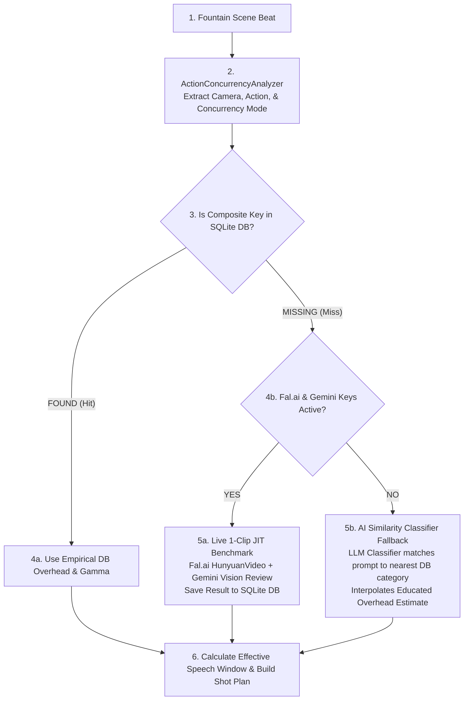

# Master Architecture & Implementation Plan: Action Timing & Concurrency Learning System

## Executive Overview

The **Action Timing & Concurrency Learning System** is a closed-loop empirical pipeline designed to solve dialogue truncation and clip duration budgeting across any story.

Instead of hardcoding guess durations or trial-and-error video generations, Film Studio:
1. **Measures empirical camera & physical action overheads** across diverse story genres (*Nick and Me*, *The Tell-Tale Heart*, *The Jungle Book*).
2. **Calculates the Effective Speech Window** incorporating the **Concurrency Overlap Factor ($\gamma$)** for serial vs. concurrent action/dialogue beats.
3. **Executes Just-In-Time (JIT) 1-clip benchmarks** for novel un-calibrated actions when API keys are present.
4. **Falls back to AI Similarity Classification** when video generation API keys are missing.
5. **Persists telemetry in SQLite (`/data/pagetomovie.db`)** to continuously train the server over time.
6. **Displays an interactive Cache Hit Rate & Accuracy Trend Graph on `/admin`**.

---

## 1. Mathematical Duration Model

### The Concurrency Overlap Factor ($\gamma$)
Action and dialogue in a beat can occur **Serially** (action before speech) or **Concurrently** (action while speaking):

$$\text{Effective Speech Window (sec)} = \text{Total Clip Duration} - \text{Camera Overhead} - \Big( (1 - \gamma) \times \text{Action Overhead} \Big)$$

Where $\gamma$ is the **Concurrency Overlap Factor** ($0.0 \le \gamma \le 1.0$):
- **Serial ($\gamma = 0.0$)**: Action completes before speech starts (e.g., *"pulls switchblade open, then speaks"*). Action overhead fully subtracts from speech capacity.
- **Concurrent ($\gamma = 0.8 - 1.0$)**: Action occurs while speaking (e.g., *"paces room while speaking"*). Action overlaps with speech, preserving speech capacity.

### Max Speech Capacity Equation
$$\text{Max Allowed Words} = \lfloor \text{Effective Speech Window (sec)} \times \text{Speech WPM Rate} \rfloor$$

---

## 2. Composite Dual-Key Benchmark Lookup Schema

Lookups in `ActionCameraOverheadLedger` and SQLite use a composite dual-key:

$$\text{Lookup Key} = \Big(\text{Camera ID}, \text{Action ID}, \text{Concurrency Mode}\Big)$$

- `("cam_push_in", "act_knife_pull", "serial")` $\rightarrow$ Base Overhead = 2.0s, $\gamma = 0.0$
- `("cam_push_in", "act_pills_sorting", "concurrent")` $\rightarrow$ Base Overhead = 2.3s, $\gamma = 0.85$

---

## 3. Just-In-Time (JIT) Benchmark & AI Classifier Fallback

---

## 4. SQLite Telemetry & Admin Dashboard Trend Graph

- **`clip_timing_telemetry` Table**: Logs `video_model_id`, `video_model_version`, `evaluator_model_id`, `evaluator_model_version`, `camera_category`, `action_category`, `word_count`, `measured_cam_overhead_sec`, `measured_action_overhead_sec`, `dialogue_truncated`, `created_at`.
- **`timing_telemetry_snapshots` Table**: Logs periodic snapshots of `hit_rate_percent` and `mean_absolute_error_sec`.
- **Admin Dashboard (`/admin`)**: Interactive Chart.js / Canvas line graph rendering **Cache Hit Rate Over Time (%)** and **MAE Accuracy Over Time (seconds)**.

---

## 5. Implementation Roadmap

1. **Step 1**: Expand benchmark dataset (`timing_prompts.json`) with composite action-dialogue concurrency test cases from *Nick and Me* and run benchmark readings.
2. **Step 2**: Implement `ActionConcurrencyAnalyzer.cs` and composite dual-key lookups in `ActionCameraOverheadLedger.cs`.
3. **Step 3**: Implement `JitBenchmarkService.cs` and `AiActionOverheadClassifier.cs`.
4. **Step 4**: Implement `ClipTimingTelemetryRepository.cs` in SQLite and map `/api/admin/timing-telemetry/trend`.
5. **Step 5**: Implement Admin Dashboard Trend Graph in `Admin.razor`.
