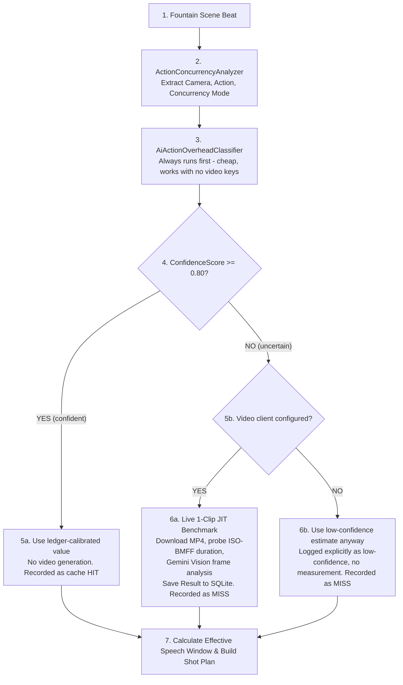

# Master Architecture & Implementation Plan: Action Timing & Concurrency Learning System

## Executive Overview

The **Action Timing & Concurrency Learning System** is a closed-loop empirical pipeline designed to solve dialogue
truncation and clip duration budgeting across any story.

Instead of hardcoding guess durations or trial-and-error video generations, Film Studio:
1. **Measures empirical camera & physical action overheads** across diverse story genres (*Nick and Me*, *The Tell-Tale Heart*, *The Jungle Book*).
2. **Calculates the Effective Speech Window** incorporating the **Concurrency Overlap Factor ($\gamma$)** for serial vs. concurrent action/dialogue beats.
3. **Classifies every beat against the calibrated index first** (cheap, instant) and only executes a **Just-In-Time (JIT) 1-clip live benchmark** when the index match is low-confidence — not on every uncalibrated beat, and not just because API keys happen to be present.
4. **Falls back to a low-confidence estimate** only when live measurement is unavailable or fails.
5. **Persists telemetry in SQLite (`/data/pagetomovie.db`)** to continuously train the server over time.
6. **Displays a live Cache Hit Rate & Accuracy Trend Graph on `/admin`**, bound to real trend rows, not sample data.

**Status as of this revision:** the ledger/classifier/JIT engine described above (§1–§5) is built and unit-tested,
but **not yet wired into the production shot-planning path.** The system that actually sets clip duration and
splits dialogue today is the older, separate `ClipDurationEstimator` + `Stage2PlannerService`. §6 below is the
integration plan that connects the two instead of running them as parallel, disagreeing systems.

---

## Constraints From Product Discussion (must hold in any implementation)

These came out of design review and are treated as hard requirements, not preferences:

1. **Video duration is quantized, not continuous.** Providers accept whole-second (or coarser) durations and
   often bill/round to tiers. A clip that's 500ms short can't be "topped up" — fixing it means paying for a full
   extra tier (or a whole regeneration). **Conclusion: bias the initial estimate conservatively (pad up front);
   do not plan to measure-then-correct after the fact.**
2. **Dialogue truncation is a content problem, not a timing problem.** If a line gets cut off or rushed, the
   audience loses story content — and later clips may reference something that was never actually heard. This is
   worse than a duration miss and must be prevented *before* generation (clean sentence/clause-boundary splits),
   not detected and patched afterward.
3. **Within a scene, clips using video-continuation (e.g. Grok `continueFromVideoPath`) are already strictly
   sequential** — `FilmJobService.GenerateOneClipAsync` hard-fails if clip N−1 isn't on disk yet. Any reconciliation
   step that runs between "clip N finishes" and "clip N+1 is requested" costs **no additional wall-clock time**,
   because that wait already happens. This does not apply across scenes (those remain parallel via the worker pool),
   and does not apply to models where `SupportsVideoContinue` is false.
4. **Users approve/regenerate at the scene level, not the clip level.** How a scene decomposes into clips is an
   implementation detail that varies by the selected video model's duration limits and continuation support — it
   must never be something the user has to reason about, and switching models must not require the user to
   re-approve or manually reconcile a different clip count.
5. **Pick-an-index beats a tuned regression at this data scale.** Chosen over training a model to predict duration
   directly: bounded failure mode (worst case, picks a real calibrated value), no cold-start problem, and stays
   auditable/fixable by editing a row instead of retraining. See `AiActionOverheadClassifier` + ledger validation
   (already implemented).
6. **JIT-discovered categories must consolidate, not accumulate forever.** `JitBenchmarkService` mints a fresh
   `jit_{hash}` category per unique action-description text today. Without a merge step, near-duplicate phrasings
   never converge onto a reusable calibrated category, and cache hit rate can't meaningfully improve over time.

---

## 1. Mathematical Duration Model — done

### The Concurrency Overlap Factor ($\gamma$)
$$\text{Effective Speech Window (sec)} = \text{Total Clip Duration} - \text{Camera Overhead} - \Big( (1 - \gamma) \times \text{Action Overhead} \Big)$$

Implemented in `ActionCameraOverheadLedger.CalculateEffectiveSpeechWindowSec` / `CalculateMaxSpeechWords`.
`ActionConcurrencyAnalyzer.AnalyzeBeat` extracts Camera ID, Action ID, Mode, and $\gamma$ from beat text via regex.

## 2. Composite Dual-Key Benchmark Lookup Schema — done

`ActionCameraOverheadLedger.CompositeLedger`: `Dictionary<(CameraId, ActionId, Mode), CompositeTimingEntry>` with
interpolated fallback to single-key overheads when no exact composite match exists.

## 3. Confidence-Gated JIT Benchmark & AI Classifier — done

`JitBenchmarkService.EnsureBeatCalibratedAsync` classifies first; only beats below the confidence threshold
(0.80 — just above the heuristic's generic-fallback confidence of 0.75) pay for a live measurement. This
directly avoids burning a video generation on every beat just because keys are configured (commit `8e8dc48`).
Camera category/overhead in telemetry now reflects the beat's actually-detected camera, not a hardcoded
`cam_push_in` (commit `263fb7e`).

## 4. SQLite Telemetry & Admin Dashboard Trend Graph — done

`clip_timing_telemetry` (+ `estimated_duration_sec` for correct MAE), `timing_cache_metrics`,
`timing_telemetry_snapshots`. Admin `/admin` trend chart renders real `GetTrendHistoryAsync` rows (with a
day-aggregated fallback when no explicit snapshots exist yet) — no more static sample polyline.

**Known gap:** `DialogueTruncated` is a real column but every write path hardcodes it `false`. See Phase 9.

---

## 5. Phase 6 — Integrate the ledger into `ClipDurationEstimator` (not yet started)

**Problem:** `ClipDurationEstimator.Estimate()` allocates visual/action time on a dialogue clip with a flat
constant — `action = actionClass is "big_action" ? 1.2 : 0.6;` — regardless of what camera movement or physical
action is actually described. A crane shot (2.7s calibrated) gets the same 0.6s budget as a whip pan (0.8s
calibrated), and the flat constant has no concept of $\gamma$ concurrency at all.

**Plan:**
- In `ClipDurationEstimator.Estimate()` / `EstimateUncapped()`, replace the flat action-time constant with a call
  through `ActionConcurrencyAnalyzer.AnalyzeBeat` → `ActionCameraOverheadLedger.CalculateEffectiveSpeechWindowSec`
  when a camera/action ID can be confidently detected from the beat's visual/action text; keep the flat constant
  as the fallback when nothing is detected (`act_generic_action` equivalent), so behavior never regresses to
  worse than today.
- Re-run `ClipDurationEstimatorTests.cs` and `BugHuntTests.cs` (both exercise this path extensively) to see what
  actually shifts before touching any generation code.
- This is the single highest-leverage change — it's the one place that turns the whole Action Timing system from
  "measured in isolation, never consulted" into "actually improves the number that decides clip duration."

## 6. Phase 7 — Model-aware clip splitting (not yet started)

**Problem:** `Stage2PlannerService` hardcodes `GrokMinClip`/`GrokMaxClip`/`GrokAbsMax` from
`ClipDurationEstimator`'s constants. Clip splitting happens once, at Stage 2 planning time, against one
assumed provider's duration window. `SupportedModelEntry` already has a real per-model capability registry
(`SupportsVideoContinue`, `SupportsReferenceImages`, `SupportsVideoReview`, `VideoCostPerSecondByResolution`) but
no duration-limit fields, so there's no way to plan differently per model today.

**Plan:**
- Add `MaxClipDurationSeconds` (and `MinClipDurationSeconds` if it varies) to `SupportedModelEntry` /
  `SupportedModelDto`, same pattern as the existing capability booleans.
- Parameterize `Stage2PlannerService` / `ClipDurationEstimator` clip-splitting by the target model's caps instead
  of the hardcoded Grok constants.
- Give "regenerate this scene with model X" a real re-split step: recompute clip boundaries for the newly
  selected model's caps (and its `SupportsVideoContinue` value — some models may not force sequential chaining
  at all) as part of that action, rather than reusing whatever clip count Stage 2 originally produced.
- UX: the scene-regen entry point in `FilmJobService`/`Program.cs` must expose only scene-level actions — clip
  count/boundaries are recomputed internally per model and never surfaced as something the user approves.

## 7. Phase 8 — Sequential within-scene reconciliation (not yet started)

**Problem/opportunity:** for continuation-based models, clip N+1 already can't start until clip N is on disk
(`FilmJobService.GenerateOneClipAsync` throws otherwise). That wait is unavoidable regardless of anything we do,
so using it to reconcile the next clip's plan against what was actually measured is free.

**Plan:**
- After clip N finishes (and its actual duration is probed, as already happens for telemetry), use the measured
  value to finalize clip N+1's word budget/duration plan **before** submitting clip N+1 — not to correct clip N,
  which per Constraint 1 is not worth doing given tiered/quantized durations.
- Only applies within a scene's continuation chain; scenes remain independent and parallel via `ApiWorkerPool`.
- Skip this entirely for models where `SupportsVideoContinue` is false, once Phase 7 makes that queryable —
  those clips may not need to be sequential at all.

## 8. Phase 9 — Real `DialogueTruncated` signal (not yet started)

**Problem:** the schema anticipated this (`DialogueTruncated` column exists), but nothing has ever set it to
`true` — `ClipDialogueVerificationService`'s Expected-vs-Heard comparison is a separate, human-reviewed-only
signal that never reaches the telemetry table.

**Plan:**
- Wire `ClipDialogueVerificationService`'s match result into the `DialogueTruncated` field when recording
  telemetry for a real generated clip (`FilmJobService`'s telemetry write, not the JIT/classifier paths, which
  don't have real dialogue to verify against).
- This gives the ledger an empirical, ground-truth signal — "this category's word budget actually causes
  truncation in practice" — independent of and more trustworthy than the wpm-based formula alone.

## 9. Phase 10 — Category consolidation: embedding + LLM merge pass (not yet started)

**Problem:** `JitBenchmarkService` mints `jit_{hash(actionDescription)}` per unique phrasing. Near-duplicate
descriptions ("pulls out a rusty blade" vs. "draws a switchblade") never converge onto the same calibrated
category, so cache hit rate can't improve no matter how much telemetry accumulates, and the ledger/classifier
prompt stay static, hand-maintained C# literals.

**Plan (staged, cheap-first):**
1. **Prerequisite:** add a `source_text` column to `clip_timing_telemetry` (currently only the opaque category id
   is stored — there's nothing to embed or cluster on otherwise). Populate from `actionDescription` +
   `parenthetical` in `JitBenchmarkService`.
2. **Candidate pull:** query `action_category LIKE 'jit_%'` grouped by category with count + averaged measured
   overhead + one representative `source_text`; gate on a minimum occurrence count (e.g. ≥3) to avoid promoting
   noise.
3. **Embedding pass (cheap):** embed each candidate's representative text once; embed the ~34 canonical category
   descriptions once and cache them. Cosine-match candidates against canonical categories first (alias, no LLM
   needed above ~0.85 similarity); cluster remaining candidates against each other at a lower threshold to find
   recurring new categories.
4. **LLM pass (only on the reduced set):** for each unresolved cluster, one batched prompt — same category as
   existing X, or propose a new snake_case id + description + overhead derived from the cluster's own averaged
   empirical measurements (never invented).
5. **Admin approval gate:** surface proposed merges/new categories on the Admin timing panel (same pattern as
   the existing "🌱 Seed Database" button); nothing writes to the ledger without an explicit approve click.
6. **DB-backed category registry:** this only pays off if `ActionCameraOverheadLedger`'s `SingleKeyOverheads` /
   `CompositeLedger` and the classifier's system-prompt category list stop being static C# literals and instead
   load from a `timing_category_registry` table, refreshed on approval — otherwise an approved merge still
   requires a code deploy to take effect.
7. **Guardrails:** cap new-category promotions per pass (e.g. 5); blend repeated observations via running
   average/median rather than overwrite-on-approve; never let a 1–2-observation cluster reach the LLM/admin step.

---

## Implementation Roadmap Summary

| Phase | Status | Summary |
|---|---|---|
| 1–4 | ✅ Done | Duration model, composite ledger, confidence-gated JIT/classifier, SQLite telemetry + live trend chart |
| 6 | Not started | Plug ledger-derived overhead into `ClipDurationEstimator`'s flat action-time constant |
| 7 | Not started | Per-model `MaxClipDurationSeconds` in `SupportedModelCatalog`; model-parameterized Stage 2 splitting; scene-level regen re-split |
| 8 | Not started | Reconcile next clip's plan against previous clip's measured result (continuation-chain scenes only) |
| 9 | Not started | Wire real dialogue-verification result into `DialogueTruncated` |
| 10 | Not started | `source_text` column → embedding cluster → LLM merge → admin-approved, DB-backed category registry |

Recommended order: **6 → 9 → 8 → 7 → 10.** Phase 6 is the highest-leverage single change (makes the existing
system's numbers actually matter) and has no dependencies. Phase 9 is a small, independent wiring change that
Phase 8's reconciliation logic will want. Phase 7 is the largest lift (touches the model catalog, Stage 2
planning, and the scene-regen entry point) and is independent of 6/8/9, so it can slip without blocking them.
Phase 10 depends on meaningful telemetry volume accumulating first, so it naturally comes last.
