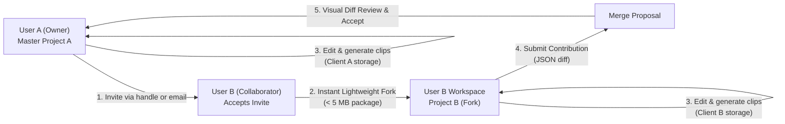
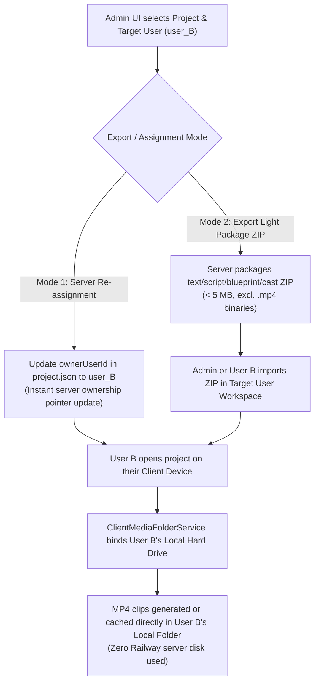
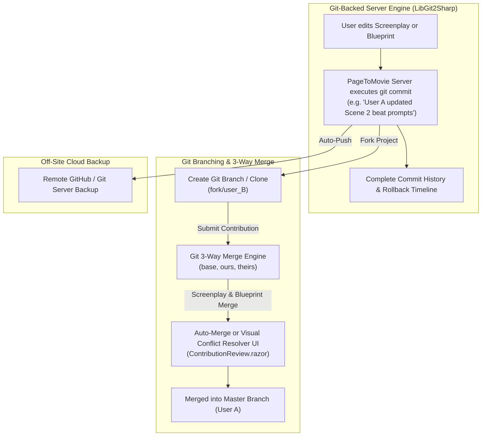
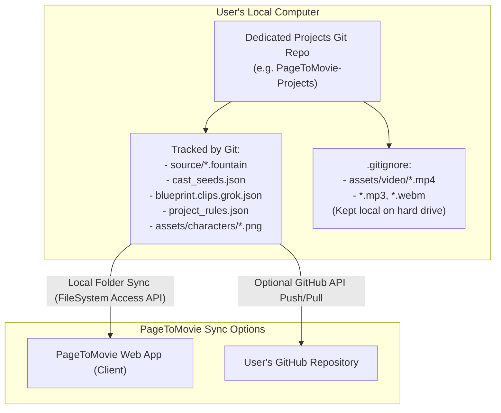
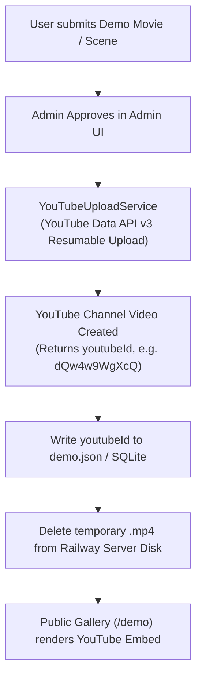

# Public community & multiplayer features (plan — not implemented)

Backlog for **project collaborators**, **public demos / modes**, **fork → contribution → owner merge**, and **upvotes**.  
Nothing in this doc is required for current production unless explicitly scheduled.

**Status key:** `idea` · `planned` · `in progress` · `done`

**Priority note:** **Project collaborators** (same project, trusted invite) ship **before** open fork/merge. Upvotes can ship independently for the gallery.

---

## Feature list

| # | Feature | Status | Notes |
|---|---------|--------|--------|
| 1 | **Project collaborators** | **planned** | Owner invites users to **same** project; see § Project collaborators. **Higher priority than fork/merge.** |
| 2 | **Demo ratings (upvotes only)** | **done** (basic) | ★ on `/demo`; sort top/new. See § Demo ratings. |
| 3 | Project / listing mode: **private · public · open** | **planned** | Locked matrix: see § Visibility modes. |
| 4 | Content hash of exportable package | idea | Freshness for contributions (fork PRs). |
| 5 | **Fork** (plan-only package v1) | idea | Copy story/cast/blueprint; no clip binaries; **open** only. |
| 6 | Fork banner + “forked from” metadata | idea | |
| 7 | **Contribution** (prompt/JSON PR) | idea | Field-level accept by owner. |
| 8 | Contribution accept / reject + conflict if origin moved | idea | See conflict notes under fork. |
| 9 | Sync fork from origin (rebase helper) | idea | |
| 10 | Media-aware fork / PR (hash upload) | idea | Later; storage + quotas. |
| 11 | Public project gallery (forkable packs) | idea | Distinct from finished-movie demos. |
| 12 | Project ratings (reuse upvote model) | idea | After public/open listings exist. |
| 13 | Text reviews on ratings | idea | Moderation burden; not v1. |
| 14 | User reputation from ratings | idea | Derived later. |

---

## Roles (lifecycle, not account types)

| Role | Meaning |
|------|---------|
| **Anon** | Browse **public** / **open** demos in gallery; play if streamable; no fork, no upvote. |
| **Signed-in** | Same + **upvote** demos; **fork** only when mode is **open**; may be **invited** as project member. |
| **Project owner** | `ownerUserId`; invite/remove members; visibility/public/open; delete project; publish demo (as today). |
| **Project editor** (collaborator) | Member of **same** project; edit/gen/review per policy; **not** owner admin actions. |
| **Fork owner / community contributor** | Same user **after** **fork** of an **open** project; edit copy; submit contribution (later). |
| **Upstream owner** | Accept/reject community contributions (later). |

“Collaborator” = invited to the **same** project.  
“Community contributor” = forked **open** project and optional PR — different path.

---

## Project collaborators (planned — high priority)

### Intent
Trusted multiplayer on **one** project (co-writer, editor). **Not** a fork: no copy, no merge UI for day-to-day work.

### Why before fork/merge
- Solves “add my partner” without public/open.
- Works on **private** projects.
- Smaller than content-hash PRs and gallery packaging.
- Scene locks / jobs already partly multi-user; need **ACL** so non-owners can open the project.

### Model (v1)

```text
project.json (or SQLite project_members)
  ownerUserId: "alice"
  members: [
    { "userId": "bob", "role": "editor", "addedAt": "..." }
  ]
```

| Role | Can |
|------|-----|
| **owner** | Full control: members, visibility/public/open, delete project, transfer (later), publish demo as owner |
| **editor** | Use studio on this project: read/write blueprint, cast, gen jobs, review, play; **cannot** remove owner, delete project, or change membership/visibility |
| **viewer** (optional v1.1) | Read-only play / view |

- **One owner** (existing `ownerUserId`).
- Invite by **username** / user id (users already in SQLite).
- Owner **remove** member; member **leave**.
- Project list: projects where user is **owner or member**.

### AuthZ
- Every project-scoped API: allow if `admin` **or** `userId == owner` **or** `userId` in members with sufficient role.
- Demo publish: keep owner (or allow editor later — default **owner only** for v1).
- Jobs/locks: members may acquire scene locks like owner.

### Credits / API keys (v1 policy)
- **Acting user** pays: gen uses **that user’s** provider keys and credits (Bob gens → Bob’s spend).
- Document clearly in UI (“Your API keys and credits are used when you generate”).
- Later option: “bill owner” with explicit consent.

### Client media folder
- Each collaborator uses **their** browser media folder; server registry is still **per project**.
- Expect each editor to connect a folder; gen handoff unchanged.

### Suggested API (future)
```http
GET    /api/projects/{id}/members
POST   /api/projects/{id}/members      { "username" or "userId", "role": "editor" }
DELETE /api/projects/{id}/members/{userId}
POST   /api/projects/{id}/members/leave
GET    /api/projects                        # include owned + member-of
```

### Out of scope for collaborators v1
- Live cursors / presence avatars  
- Per-scene or per-clip ACL  
- Email magic-link invites (username invite is enough)  
- Automatic fork from invite  
- Split billing  

### Depends on
- Existing `ownerUserId` on project + user accounts.

### Does not depend on
- Public/open modes, fork, contributions, upvotes.

### Collaborators vs fork

| | Collaborator | Fork |
|--|--------------|------|
| Project | **Same** id | **New** id |
| Trust | Invite-only | Open community |
| Merge | N/A (same project) | Contribution accept |
| Modes | Works on **private** | Requires **open** |

---

## Visibility modes (locked)

Owner chooses one mode for the **public surface** of their work (demo listing and, when present, linked project package).

| Mode | Others can **play** (demo stream / gallery) | Others can **fork** (studio package) |
|------|-----------------------------------------------|--------------------------------------|
| **Private** | No | No |
| **Public** | Yes | No |
| **Open** | Yes | Yes |

### Rules
- **Default:** **private** (not in gallery; no public play; no fork).
- **Public:** listed (after any demo moderation); watch-only; **no** Fork button.
- **Open:** same as public **plus** Fork (plan-only package v1 when implemented).
- No separate “unlisted” mode in v1 (add later only if share-by-link without gallery is needed).
- Demo **publish** today still goes **pending → public** for the movie file; align product language so “make public” / “make open” sets this matrix (implementation later).
- Upvotes apply only when the demo is playable in the public gallery (**public** or **open** approved demos).
- **Collaborators** can work on a project in any mode; membership is independent of public/open.

### Naming
| Internal | UI (examples) |
|----------|----------------|
| `private` | Private |
| `public` | Public (watch only) |
| `open` | Open (watch + fork) |

---

## Demo ratings (basic implementation shipped)

Implemented: `DemoUpvoteService` (SQLite `demo_upvotes`), `POST/DELETE /api/demos/{id}/upvote`, gallery `sort=top|new`, Demo page ★ button.

### Intent
Lightweight quality signal for **approved public demos**. Independent of fork/merge and of collaborators.

### Model: **upvotes only** (chosen)
- One control: **★ / upvote** (toggle on/off), not 1–5 stars and not downvotes.
- **Signed-in only**; **at most one upvote per user per demo** (add or remove).
- UI shows **upvote count** (and whether *I* upvoted).
- Gallery **rankings by most upvotes** (descending count). Tie-break: newer publish, or title.

Why this shape:
- Simple mental model (“star this demo”).
- No revenge downs / 1★ brigading.
- Ranking is just a sort key — no averages or Bayesian priors required for v1.
- Matches “most stars” language without a 5-star scale.

### v1 product rules (when built)
- Target: demos that are gallery-playable — modes **public** or **open** (catalog status approved/`public` as today).
- **No self-upvote** (recommended).
- **No free-text review**.
- Unpublish / remove → drop from gallery; keep or delete votes (prefer delete or hide).
- Does **not** gate play; admin approve/reject stays the publish gate.
- Optional secondary sorts later: **New**, **Trending** (upvotes in last N days).

### Ranking
| Sort | Definition |
|------|------------|
| **Top (default for “ranked”)** | `upvoteCount` DESC, then `createdAt` DESC |
| **New** | `createdAt` DESC (ignore votes) |
| **Trending** (later) | upvotes with `updatedAt` in last 7d, or time-decayed score |

No minimum vote threshold required for “Top” if the only signal is count (a single upvote legitimately ranks above zero). Optional: pin admin “featured” above organic Top.

### Suggested API (future)
```http
POST   /api/demos/{id}/upvote      # idempotent: ensure my upvote exists
DELETE /api/demos/{id}/upvote      # remove my upvote
GET    /api/demos?sort=top|new     # include upvoteCount, upvotedByMe
GET    /api/demos/{id}             # same
```

### Storage (future)
```text
demo_upvotes (
  demo_id   TEXT NOT NULL,
  user_id   TEXT NOT NULL,
  created_at TEXT NOT NULL,
  PRIMARY KEY (demo_id, user_id)
)
```
- `upvoteCount` = `COUNT(*)` per demo (or denormalized counter on demo meta, updated on vote).

### Out of scope for demo-ratings v1
- 1–5 star scales  
- Downvotes  
- Clip-level votes  
- Contribution/PR votes  
- Fork inherits upvotes (no)  
- Anon voting  
- Text reviews  

### Depends on
- Existing public demo catalog + auth JWT (already present).

### Does not depend on
- Project fork/merge or collaborators.

---

## Fork → merge (summary — planned later)

Community path for **strangers** on **open** projects. Prefer **collaborators** for trusted co-production on one project.

### When fork is allowed
- Only if owner mode is **open** (play yes, fork yes).
- **Public** (play only): no fork CTA.
- **Private:** no play, no fork.
- Demo page may show **Fork** when the listing is **open** and a forkable project package exists; play uses the demo movie snapshot either way.

### v1 fork
- Copy L0–L4: source/screenplay, cast, blueprint, rules, config (strip secrets).
- Skip or reset: cost ledger, private review state, client-only MP4 bytes (plan-only).
- New `projectId`, `ownerUserId` = forker; record `sourceProjectId` + hash at fork.

### v1 contribution
- Structured diff (blueprint clip fields, cast fields, optional screenplay).
- Owner accepts selected paths; reject if upstream `contentHash` ≠ contribution base (rebase).
- Field-level conflict resolution (3-way vs base): keep origin / take fork / skip — no silent text merge.

### Merge atoms: characters vs scenes (locked direction)
| Layer | Default merge / conflict unit | UI |
|-------|-------------------------------|-----|
| **Characters** | **Character package** (description, visual_lock, voice, optional ref); optional expand to fields | Group under Cast |
| **Scenes / clips** | **Clip field** (e.g. `S02C03.visual_prompt`, dialogue bundle); not whole scene by default | Group by scene → clips |
| **Whole scene** | Bulk “select all clips in Sxx” only — not a primitive blob replace | |
| **Coupling** | Character and clip accepts are **independent**; optional “N clips in this PR use this character” hint | |
| **Structure** | v1: edit existing `SxxCyy` / characters only — no silent add/delete/reorder in PR | |

Characters are **global** (high blast radius); scenes are a **timeline of clips**. Prefer character-level packages and clip-level fields; do not force atomic “whole scene” or “character + all clips” accepts in v1.

## Project Collaborators & Invite-to-Fork Workflow

### Intent
Instead of forcing multiple users to edit the same live project files simultaneously (which risks file lock conflicts and overwritten edits), PageToMovie uses an **Invite-to-Fork & Async Diff-Merge** collaboration model.



### Detailed Workflow & Security Model

1. **Privacy-Preserving Invitation & Search**:
   - Project Owner A opens the **Collaborate & Invite** modal in the UI.
   - *Public Handle Search (`@username`)*: Owner A types `@username` to search existing creator handles. The API queries SQLite `users` table (`username` column) and returns public handles only — **raw email addresses are never returned to the browser**.
   - *Blind Email Delivery*: Owner A can type a recipient's direct email address (`partner@example.com`). The server dispatches the invite link via Resend API without revealing to the client whether an account exists for that email.
   - *Zero DB Schema Changes*: SQLite `users` table already stores both `username TEXT NOT NULL UNIQUE` and `email TEXT`.
2. **Invitation Tokens & Acceptance (`/join?token=inv_...`)**:
   - The API generates a secure, 48-hour single-use token (`inv_...`).
   - When User B clicks the link (or accepts via in-app dashboard badge), PageToMovie executes `ForkProjectAsync`.
3. **Instant Lightweight Fork**:
   - Creates `Project A (Fork)` under User B's account (< 5 MB package containing Fountain script, cast seeds, reference images, and shot plan blueprint; excluding video binaries).
4. **Independent Local Work**:
   - User A and User B work independently on their own client storage (IndexedDB / OPFS / local PC folder). Neither user blocks or locks the other's workspace.
5. **Contribution Submission**:
   - User B completes edits (e.g. prompt tuning or beat timing changes) and clicks "Submit Contribution to Owner".
6. **Side-by-Side Visual Diff Review & Merge**:
   - Owner A receives a notification, views a side-by-side visual diff grouped by **Cast** and **Scenes/Clips** in `ContributionReview.razor`, and accepts/merges the changes into master `Project A`.

---

## Admin Cross-User Export & Client-Local Storage Handoff

### Intent
Enable Admin to transfer or export any project directly into any target user's project area, ensuring that video binaries end up stored locally on the target user's hard drive rather than eating up server disk space.



### Technical Workflow

1. **Lightweight Server Package / Re-assignment**:
   - The server project archive (`ProjectArchiveService.cs`) contains screenplay text, `cast_seeds.json`, character reference portraits (`assets/characters/*.png`), Stage 2 shot plan (`blueprint.clips.grok.json`), `project_rules.json`, and `pipeline_config.json`.
   - The server package is **100% lightweight (< 5 MB)** because heavy `.mp4` video binaries are excluded.
   - Admin specifies `targetUserId` in `Admin.razor`.
2. **Instant Ownership Transfer**:
   - The server writes `ownerUserId: "user_B"` into `project.json`.
   - The project immediately appears in User B's dashboard upon next login (`GET /api/projects` filtered by `ownerUserId == user_B`).
3. **Client-Local Hard Drive Binding**:
   - When User B logs in on their computer and opens the project in PageToMovie Studio, `ClientMediaFolderService.cs` binds User B's local hard drive directory (e.g. `C:\Users\UserB\PageToMovie\Projects\ProjectA\video\`).
   - Any video clips generated or synced by User B are saved directly to User B's local hard drive.
   - The Railway server remains at **0 MB video storage cost** for User B's project.

---

## Git-Backed Server Storage, Auto-Commit History & 3-Way Merge Engine

### Intent
Use **Git as the underlying storage and version control engine** for PageToMovie project state on the server (`LibGit2Sharp` / libgit2). Gives every project an automatic commit history, branch-based forking, and battle-tested **Git 3-way merge** for screenplays and blueprints.



### Key Technical Capabilities

1. **Auto-Commit History**:
   - Every time a user updates a screenplay (`source/*.fountain`), modifies a shot prompt (`blueprint.clips.grok.json`), or edits cast seeds (`cast_seeds.json`), PageToMovie automatically creates a Git commit.
   - Users can view a **Revision History Timeline** in the UI and instantly restore any previous commit.
2. **Git 3-Way Screenplay & Blueprint Merging**:
   - Leverages Git's 3-way merge algorithm (`ours`, `theirs`, `base`) to merge Fountain screenplay line changes and JSON blueprint field edits when a collaborator submits a contribution.
   - Eliminates custom merge code by relying on battle-tested Git merge logic.
3. **Visual Conflict Resolver UI (`ContributionReview.razor`)**:
   - If User A and User B modified the exact same screenplay line or clip prompt, PageToMovie renders a visual 3-way diff editor showing **Original (Base)**, **Owner A (Ours)**, and **Collaborator B (Theirs)**.
4. **Remote GitHub Cloud Backup**:
   - The Railway server can automatically push project commits to GitHub (or any Git server) for off-site disaster recovery and backup.
   - `.gitignore` excludes `assets/video/*.mp4`, ensuring backup repos remain lightweight (< 5 MB).

---

## Dedicated Projects Git Repository & Local Storage Architecture

### Intent
Separate the PageToMovie application codebase from user film project content. Enable creators to store and version-control their projects in a **dedicated Git repository** (e.g. `PageToMovie-Projects` or GitHub), keeping heavy `.mp4` video files stored locally on their PC hard drive (ignored by git).



### Architecture & Workflow

1. **Dedicated Projects Repository**:
   - Creators maintain a separate Git repository (e.g. `PageToMovie-Projects`) containing project folders (`Buster/`, `B7/`, `The Tell-Tale Heart/`).
   - `.gitignore` specifies `assets/video/`, `*.mp4`, `*.mp3`, `*.webm`, `*.wav` so heavy video binaries are **never** committed to Git or the app repository.
   - Git tracks all screenplay text, character reference images, shot plan blueprints, and rules.
2. **Client Local Storage Binding (`ClientMediaFolderService.cs`)**:
   - In PageToMovie Studio, the user connects their project folder from their local Git repository.
   - Generated MP4 clips are written directly to `assets/video/` on their local PC hard drive (ignored by git).
3. **Git Version Control & Collaboration**:
   - Creators use standard `git commit` and `git push` (or an optional **"Push to GitHub"** button in PageToMovie Studio) to track blueprint and screenplay revisions.
   - Other collaborators can clone the projects Git repo, connect their local media folder, and generate/preview clips on their own machines.

---

## Demo Gallery & YouTube Auto-Upload Pipeline

### Intent
Zero-server-disk public demo gallery powered by automated YouTube video uploads via YouTube Data API v3. Completely eliminates Railway disk usage and server streaming bandwidth for public demo videos while driving views and subscribers directly to your YouTube Channel.

### Architecture & Automated Workflow



- **API Auto-Upload (`YouTubeUploadService.cs`)**:
  - Uses YouTube Data API v3 (`POST https://www.googleapis.com/upload/youtube/v3/videos?uploadType=resumable&part=snippet,status`).
  - Configured via OAuth2 credentials in Railway environment (`YouTube__ClientId`, `YouTube__ClientSecret`, `YouTube__RefreshToken`).
  - Upon demo approval, PageToMovie streams the MP4 video directly to your YouTube Channel as Public or Unlisted, sets the title, description, tags, and category, and retrieves the generated `youtubeId`.
- **Immediate Local Purge**: As soon as the upload completes, PageToMovie deletes the temporary `.mp4` file from Railway disk.
- **Embedded Playback**: The public `/demo` page renders an embedded, privacy-enhanced YouTube iframe player (`<iframe src="https://www.youtube-nocookie.com/embed/{youtubeId}"></iframe>`).
- **Manual Fallback**: Admin UI allows manual YouTube URL/ID pasting if an offline video was uploaded out-of-band.
- **Server Footprint**: **0 MB for video files**. `demo.json` / SQLite stores only metadata (title, author, screenplay snippet, upvote count, YouTube ID).

### Step-by-Step Setup Guide: Creating & Connecting Your PageToMovie YouTube Channel

#### Step 0: Create Your Dedicated "PageToMovie" Brand YouTube Channel
1. Open [YouTube.com](https://www.youtube.com) signed in with your Google account.
2. Go to [youtube.com/channel_switcher](https://www.youtube.com/channel_switcher).
3. Click **Create a channel**, name it **PageToMovie** (or **PageToMovie Studio**), check the agreement box, and click **Create**.
4. In [YouTube Studio](https://studio.youtube.com) $\rightarrow$ **Customization**, set your handle (`@PageToMovie`), bio, logo avatar, and website link (`https://pagetomovie-production.up.railway.app`).
5. In **Settings** $\rightarrow$ **Channel** $\rightarrow$ **Feature Eligibility**, complete **Phone Verification** to unlock custom thumbnails and long/unlisted video uploads for API integration.

#### Step 1: Create Google Cloud Project & Enable YouTube Data API v3
1. Open the [Google Cloud Console](https://console.cloud.google.com/).
2. Click the project dropdown in the top bar and select **New Project**. Name it `PageToMovie Studio` and click **Create**.
3. In the left navigation menu, go to **APIs & Services** $\rightarrow$ **Library**.
4. Search for `YouTube Data API v3`, click it, and click **Enable**.

#### Step 2: Configure OAuth Consent Screen
1. Go to **APIs & Services** $\rightarrow$ **OAuth consent screen**.
2. Select **External** (or Internal if using Google Workspace) and click **Create**.
3. Enter App Name (`PageToMovie`), User support email, and Developer contact email. Click **Save and Continue**.
4. In the **Scopes** tab, click **Add or Remove Scopes**, search for `youtube.upload`, check `https://www.googleapis.com/auth/youtube.upload`, and click **Update** $\rightarrow$ **Save and Continue**.
5. In the **Test Users** tab, add your Google account email associated with your YouTube Channel. Click **Save and Continue**.

#### Step 3: Create OAuth2 Client ID & Client Secret
1. Go to **APIs & Services** $\rightarrow$ **Credentials**.
2. Click **Create Credentials** $\rightarrow$ **OAuth client ID**.
3. Set **Application type** to **Web application**.
4. Set **Name** to `PageToMovie YouTube Uploader`.
5. Under **Authorized redirect URIs**, click **Add URI** and enter:
   - `https://developers.google.com/oauthplayground`
6. Click **Create**.
7. Copy your **Client ID** (`YouTube__ClientId`) and **Client Secret** (`YouTube__ClientSecret`).

#### Step 4: Generate Refresh Token (via Google OAuth 2.0 Playground)
1. Open [Google OAuth 2.0 Playground](https://developers.google.com/oauthplayground).
2. Click the gear icon ⚙️ in the upper right corner:
   - Check **Use your own OAuth credentials**.
   - Paste your **OAuth Client ID** and **OAuth Client Secret**.
3. In the left panel under **Step 1 Select & authorize APIs**:
   - Scroll down to **YouTube Data API v3**.
   - Expand it and check `https://www.googleapis.com/auth/youtube.upload`.
   - Click the blue **Authorize APIs** button.
4. Log in with the Google Account that owns your YouTube Channel and click **Continue / Allow**.
5. In **Step 2 Exchange authorization code for tokens**:
   - Click the blue **Exchange authorization code for tokens** button.
6. Copy the generated **Refresh Token** (`YouTube__RefreshToken`).

#### Step 5: Configure Railway Environment Variables
In your Railway Dashboard $\rightarrow$ **Variables** (or local `appsettings.json` / environment):

| Variable Name | Example Value |
| :--- | :--- |
| `YouTube__ClientId` | `123456789-abcdef.apps.googleusercontent.com` |
| `YouTube__ClientSecret` | `GOCSPX-abc123xyz456...` |
| `YouTube__RefreshToken` | `1//04abc123xyz...` |

---

## Client Media Storage & Server Media Pruner

### Intent
Keep generated MP4 clips and scene previews on client devices while enforcing a strict capacity guard on Railway server disk space.

### Architecture
- **Client Storage**: Gen clips live in the browser media folder (IndexedDB / OPFS / Local PC Folder) via `ClientMediaFolderService.cs`.
- **Browser Stitching**: `ClientVideoStitchService.cs` uses **ffmpeg.wasm** in the Blazor client to compile scene/screenplay movies locally.
- **Server Media Pruner (`ServerMediaPruningService.cs`)**: Hosted background service on Railway that inspects `projects/{id}/assets/video/` and `demos/`. Automatically purges server-cached `.mp4` files older than 48 hours or whenever container disk usage > 80%. Server disk footprint remains **< 100 MB total**.

---

## Technical Component & File Map

| Component | Target File | Responsibility |
|-----------|-------------|----------------|
| **YouTube API Auto-Uploader** | [YouTubeUploadService.cs](file:///C:/Users/budcr/source/repos/gemini/PageToMovie/host/PageToMovie.Engine/YouTubeUploadService.cs) | YouTube Data API v3 OAuth2 resumable upload & server disk auto-purge. |
| **Privacy Search & Invite API** | [Program.cs](file:///C:/Users/budcr/source/repos/gemini/PageToMovie/host/PageToMovie.Api/Program.cs) | Gated `GET /api/users/search`, `POST /api/projects/{id}/invites`, and `/join` invite acceptance. |
| **Invite UI Modal** | [ProjectCollaboratorsModal.razor](file:///C:/Users/budcr/source/repos/gemini/PageToMovie/host/PageToMovie.Web/Components/Modals/ProjectCollaboratorsModal.razor) | Modal with handle search (`@username`) and blind email invite input. |
| **Lightweight Forking** | [ProjectArchiveService.cs](file:///C:/Users/budcr/source/repos/gemini/PageToMovie/host/PageToMovie.Engine/ProjectArchiveService.cs) | `ForkProjectAsync` creates < 5 MB text/metadata project forks excluding video binaries. |
| **Contribution & Merge Engine** | [ProjectContributionService.cs](file:///C:/Users/budcr/source/repos/gemini/PageToMovie/host/PageToMovie.Engine/ProjectContributionService.cs) | Generates structured JSON diffs and executes field-level merge into master project. |
| **Diff Viewer UI** | [ContributionReview.razor](file:///C:/Users/budcr/source/repos/gemini/PageToMovie/host/PageToMovie.Web/Components/Pages/ContributionReview.razor) | Side-by-side visual diff viewer for cast and scene edits. |
| **Server Media Pruner** | [ServerMediaPruningService.cs](file:///C:/Users/budcr/source/repos/gemini/PageToMovie/host/PageToMovie.Engine/ServerMediaPruningService.cs) | Railway 48h TTL & 80% disk capacity auto-pruner hosted service. |
| **YouTube Demo Catalog** | [DemoCatalogService.cs](file:///C:/Users/budcr/source/repos/gemini/PageToMovie/host/PageToMovie.Engine/DemoCatalogService.cs) | Stores `YoutubeId` and `YoutubeUrl` in demo metadata. |
| **YouTube Gallery UI** | [Demo.razor](file:///C:/Users/budcr/source/repos/gemini/PageToMovie/host/PageToMovie.Web/Components/Pages/Demo.razor) | Privacy-enhanced YouTube iframe player embed (`youtube-nocookie.com`). |

---

## Suggested Ship Order

1. **Demo Upvotes + Ranking** — **done (basic)** on `/demo`.  
2. **YouTube Demo Gallery Hosting** — store `youtube_id` in demo metadata, render YouTube iframe player in `/demo`, zero server video disk usage.
3. **Client Media Storage & Server Media Pruner** — Railway background 48h TTL media pruner (`ServerMediaPruningService.cs`) + client-side IndexedDB/OPFS fallback.
4. **Lightweight Project Export & Fork Packaging** — update `ProjectArchiveService` to export light ZIP packages (< 5 MB) excluding `.mp4` binaries.
5. **Invite-to-Fork & Privacy Search** — handle search (`@username`), blind email invites via Resend API, invite acceptance landing route (`/join`), lightweight fork creation.
6. **Async Contribution & Visual Diff Review** — `ProjectContributionService` field-level diffs and `ContributionReview.razor` merge UI.

---

*Last updated: 2026-07-26 — comprehensive single source of truth for Client MP4 Storage, Server Media Pruner, YouTube Demo Hosting, and Privacy-Preserving Invite-to-Fork Collaboration.*
