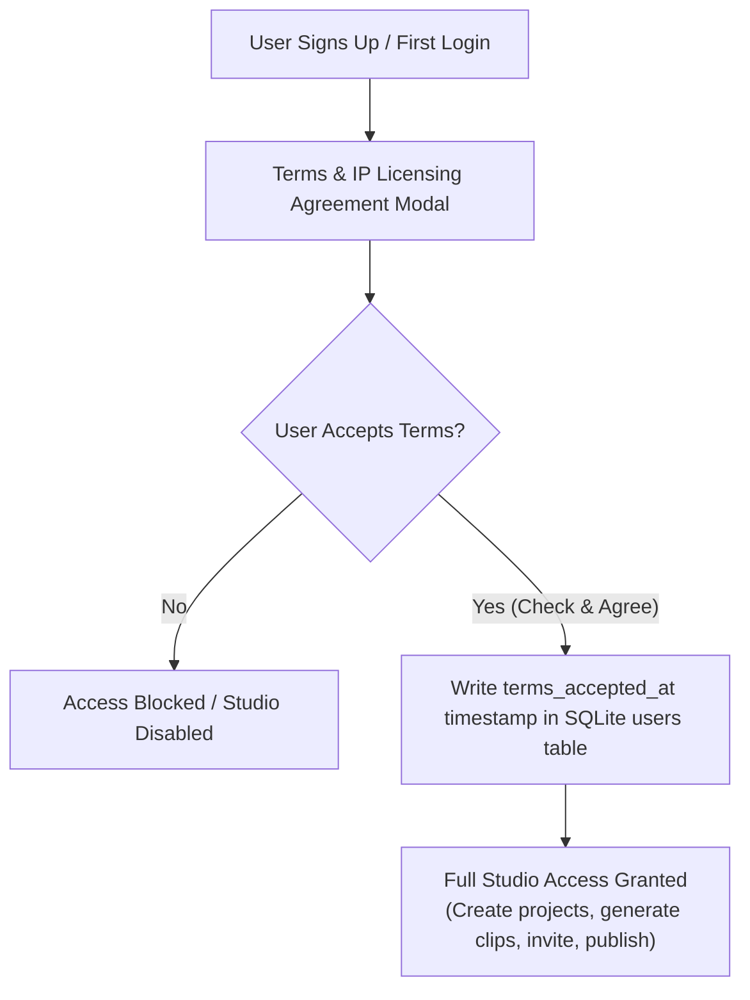
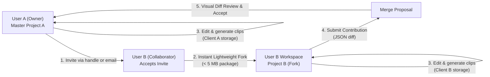
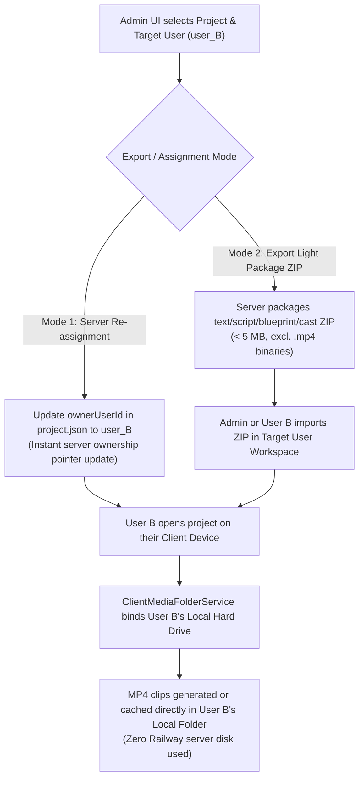
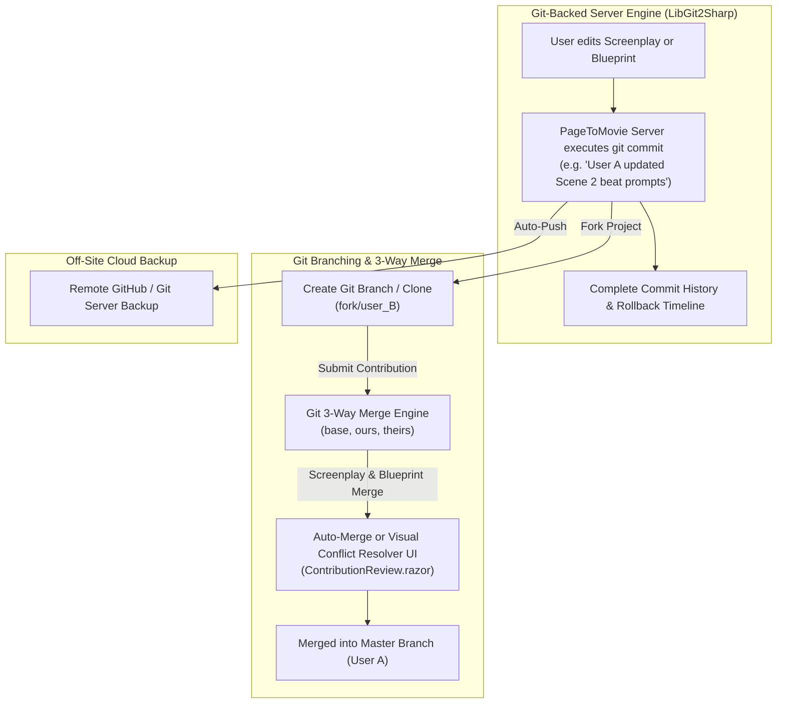
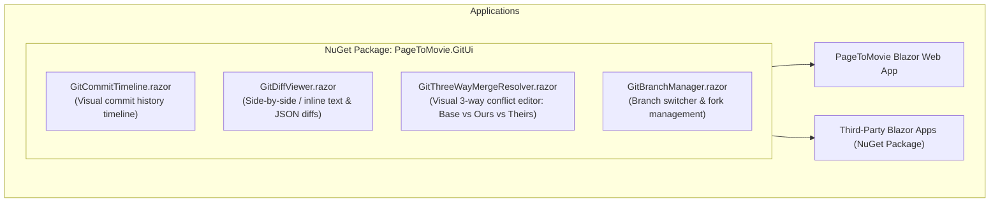
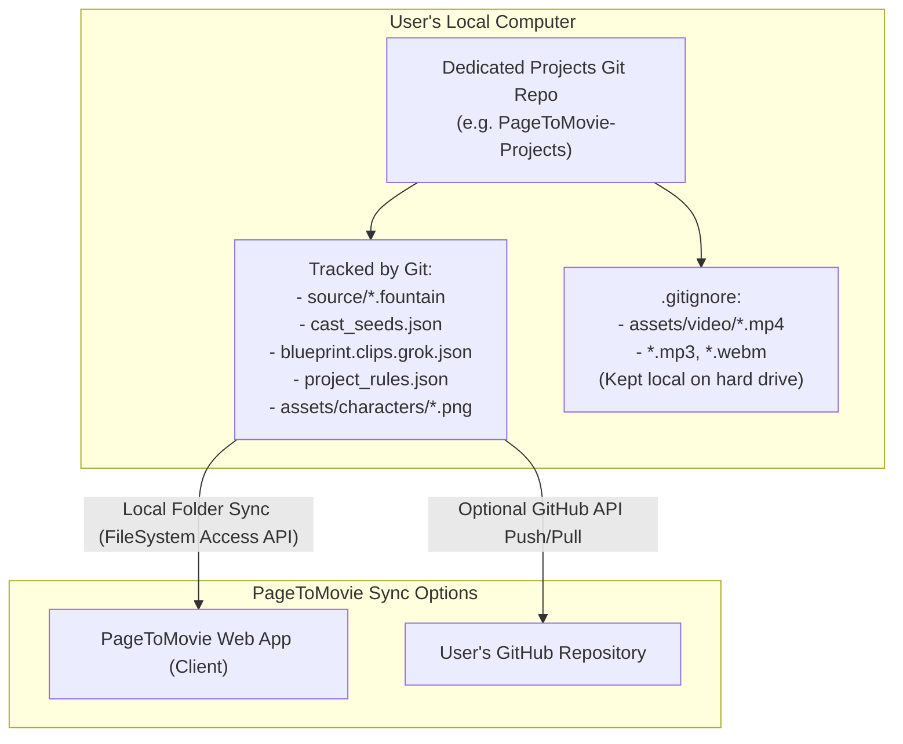
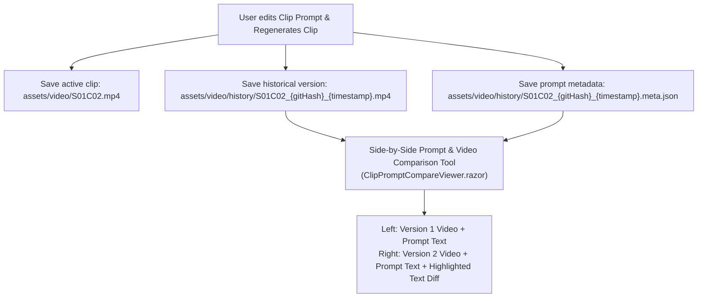
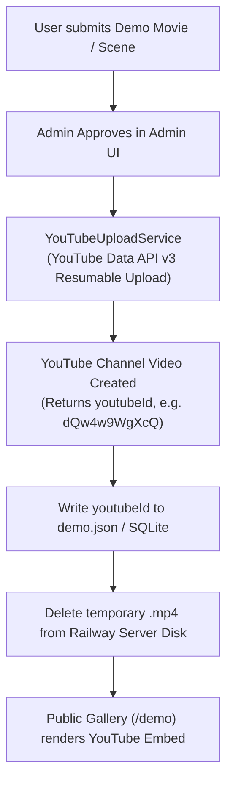
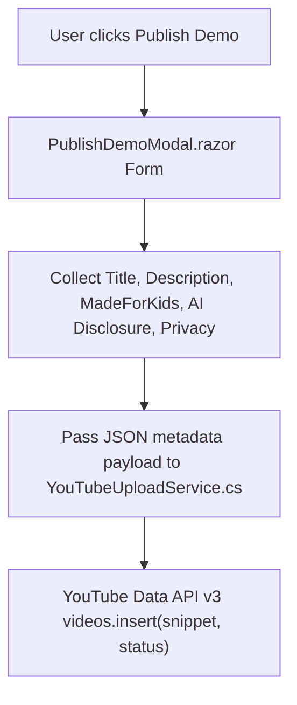

# Public community & multiplayer features (plan — not implemented)

Backlog for **project collaborators**, **public demos / modes**, **fork → contribution → owner merge**, and **upvotes**.  
Nothing in this doc is required for current production unless explicitly scheduled.

**Priority Note**: Collaboration is unified under the **Invite-to-Fork & Async Diff-Merge Model** powered by client-side media storage, Git-backed server engine (`LibGit2Sharp`), and privacy-preserving user invites.

---

## Feature list

| # | Feature | Status | Notes |
|---|---------|--------|--------|
| 1 | **Invite-to-Fork Collaboration** | **planned** | Unified collaboration model: Owner invites collaborators via `@username` or email to create lightweight forks (< 5 MB) merged via Git 3-way engine. |
| 2 | **Demo ratings (upvotes only)** | **done** (basic) | ★ on `/demo`; sort top/new. See § Demo ratings. |
| 3 | Repository Visibility Modes | **planned** | Standard Git modes: **Private**, **Public (Read-Only)**, **Public (Forkable)**. See § Repository Visibility Modes. |
| 4 | Content hash of exportable package | **planned** | SHA-256 clip provenance auto-approval & freshness check. |
| 5 | **Fork** (plan-only package v1) | **planned** | Lightweight copy of script, cast, blueprint, config (< 5 MB); clip binaries stored in local client media storage. |
| 6 | Fork banner + “forked from” metadata | **planned** | Tracks parent project origin (`parentProjectId`). |
| 7 | **Contribution & Git 3-Way Merge** | **planned** | Git 3-way merge engine (`LibGit2Sharp`) with visual diff review (`ContributionReview.razor`). |
| 8 | Contribution accept / reject + conflict if origin moved | idea | See conflict notes under fork. |
| 9 | Sync fork from origin (rebase helper) | idea | |
| 10 | Media-aware fork / PR (hash upload) | idea | Later; storage + quotas. |
| 11 | **Direct Gallery "Fork Project" Button** | **planned** | Integrates 🍴 **Fork Project** button directly onto `/demo` gallery cards & detail modals for **Public (Forkable)** projects. Eliminates need for a separate project page. |
| 12 | Project ratings (reuse upvote model) | idea | After public/open listings exist. |
| 13 | Text reviews on ratings | idea | Moderation burden; not v1. |
| 14 | User reputation from ratings | idea | Derived later. |

---

## Roles (lifecycle, not account types)

| Role | Meaning |
|------|---------|
| **Anon** | Browse **public** / **open** demos in gallery; play if streamable; no fork, no upvote. |
| **Signed-in** | Same + **upvote** demos; **fork** only when mode is **open**; may be **invited** as project member. |
| **Project owner** | `ownerUserId`; invite/remove members; visibility/public/open; delete project; publish demo (as today). |
| **Project editor** (collaborator) | Member of **same** project; edit/gen/review per policy; **not** owner admin actions. |
| **Fork owner / community contributor** | Same user **after** **fork** of an **open** project; edit copy; submit contribution (later). |
| **Upstream owner** | Accept/reject community contributions (later). |

“Collaborator” = invited to the **same** project.  
“Community contributor” = forked **open** project and optional PR — different path.

---

## Project collaborators (planned — high priority)

### Intent
Trusted multiplayer on **one** project (co-writer, editor). **Not** a fork: no copy, no merge UI for day-to-day work.

### Why before fork/merge
- Solves “add my partner” without public/open.
- Works on **private** projects.
- Smaller than content-hash PRs and gallery packaging.
- Scene locks / jobs already partly multi-user; need **ACL** so non-owners can open the project.

### Model (v1)

```text
project.json (or SQLite project_members)
  ownerUserId: "alice"
  members: [
    { "userId": "bob", "role": "editor", "addedAt": "..." }
  ]
```

| Role | Can |
|------|-----|
| **owner** | Full control: members, visibility/public/open, delete project, transfer (later), publish demo as owner |
| **editor** | Use studio on this project: read/write blueprint, cast, gen jobs, review, play; **cannot** remove owner, delete project, or change membership/visibility |
| **viewer** (optional v1.1) | Read-only play / view |

- **One owner** (existing `ownerUserId`).
- Invite by **username** / user id (users already in SQLite).
- Owner **remove** member; member **leave**.
- Project list: projects where user is **owner or member**.

### AuthZ
- Every project-scoped API: allow if `admin` **or** `userId == owner` **or** `userId` in members with sufficient role.
- Demo publish: keep owner (or allow editor later — default **owner only** for v1).
- Jobs/locks: members may acquire scene locks like owner.

### Credits / API keys (v1 policy)
- **Acting user** pays: gen uses **that user’s** provider keys and credits (Bob gens → Bob’s spend).
- Document clearly in UI (“Your API keys and credits are used when you generate”).
- Later option: “bill owner” with explicit consent.

### Client media folder
- Each collaborator uses **their** browser media folder; server registry is still **per project**.
- Expect each editor to connect a folder; gen handoff unchanged.

### Suggested API (future)
```http
GET    /api/projects/{id}/members
POST   /api/projects/{id}/members      { "username" or "userId", "role": "editor" }
DELETE /api/projects/{id}/members/{userId}
POST   /api/projects/{id}/members/leave
GET    /api/projects                        # include owned + member-of
```

### Out of scope for collaborators v1
- Live cursors / presence avatars  
- Per-scene or per-clip ACL  
- Email magic-link invites (username invite is enough)  
- Automatic fork from invite  
- Split billing  

### Depends on
- Existing `ownerUserId` on project + user accounts.

### Does not depend on
- Public/open modes, fork, contributions, upvotes.

### Collaborators vs fork

| | Collaborator | Fork |
|--|--------------|------|
| Project | **Same** id | **New** id |
| Trust | Invite-only | Open community |
| Merge | N/A (same project) | Contribution accept |
| Modes | Works on **private** | Requires **open** |

---

## Repository Visibility Modes (Standard Git Terminology)

Project owners select a Git-aligned visibility level controlling public access and community forking rights:

| Git Visibility Mode | Public Play (YouTube Stream) | Community Forking (Studio Blueprint & Script Package) | Access Control |
| :--- | :--- | :--- | :--- |
| 🔒 **Private Repository** | No | No | Owner & invited collaborators (`@username` / email) only |
| 👁️ **Public Repository (Read-Only)** | Yes | No | Listed in public gallery; watch-only; **Forking Disabled** |
| 🍴 **Public Repository (Forkable)** | Yes | Yes | Listed in public gallery; **Open Community Forking & Pull-Requests Enabled** |

### Direct `/demo` Gallery "Fork Project" Integration

Rather than requiring a separate navigation page, the **🍴 Fork Project** action is integrated directly into the existing `/demo` gallery cards and movie detail modals:

```text
┌─────────────────────────────────────────────────────────────┐
│  The Tell-Tale Heart                                        │
│  By @edgar_allan_poe  •  Public Repo (Forkable)             │
├─────────────────────────────────────────────────────────────┤
│  [ YouTube Embedded Player ]                                │
├─────────────────────────────────────────────────────────────┤
│  👍 42 Upvotes   │  📜 View Screenplay  │  🍴 Fork Project  │
└─────────────────────────────────────────────────────────────┘
```

- **Zero Friction**: Viewers watch the movie and click **🍴 Fork Project** directly on the gallery card to immediately fork the Fountain script, cast seeds, and Stage 2 shot plan blueprint (< 5 MB package) into their workspace!
- **Eliminates Redundant Pages**: Keeps the application clean and fast without needing an additional "project listing page".

---
- Demo **publish** today still goes **pending → public** for the movie file; align product language so “make public” / “make open” sets this matrix (implementation later).
- Upvotes apply only when the demo is playable in the public gallery (**public** or **open** approved demos).
- **Collaborators** can work on a project in any mode; membership is independent of public/open.

### Naming
| Internal | UI (examples) |
|----------|----------------|
| `private` | Private |
| `public` | Public (watch only) |
| `open` | Open (watch + fork) |

---

## Demo ratings (basic implementation shipped)

Implemented: `DemoUpvoteService` (SQLite `demo_upvotes`), `POST/DELETE /api/demos/{id}/upvote`, gallery `sort=top|new`, Demo page ★ button.

### Intent
Lightweight quality signal for **approved public demos**. Independent of fork/merge and of collaborators.

### Model: **upvotes only** (chosen)
- One control: **★ / upvote** (toggle on/off), not 1–5 stars and not downvotes.
- **Signed-in only**; **at most one upvote per user per demo** (add or remove).
- UI shows **upvote count** (and whether *I* upvoted).
- Gallery **rankings by most upvotes** (descending count). Tie-break: newer publish, or title.

Why this shape:
- Simple mental model (“star this demo”).
- No revenge downs / 1★ brigading.
- Ranking is just a sort key — no averages or Bayesian priors required for v1.
- Matches “most stars” language without a 5-star scale.

### v1 product rules (when built)
- Target: demos that are gallery-playable — modes **public** or **open** (catalog status approved/`public` as today).
- **No self-upvote** (recommended).
- **No free-text review**.
- Unpublish / remove → drop from gallery; keep or delete votes (prefer delete or hide).
- Does **not** gate play; admin approve/reject stays the publish gate.
- Optional secondary sorts later: **New**, **Trending** (upvotes in last N days).

### Ranking
| Sort | Definition |
|------|------------|
| **Top (default for “ranked”)** | `upvoteCount` DESC, then `createdAt` DESC |
| **New** | `createdAt` DESC (ignore votes) |
| **Trending** (later) | upvotes with `updatedAt` in last 7d, or time-decayed score |

No minimum vote threshold required for “Top” if the only signal is count (a single upvote legitimately ranks above zero). Optional: pin admin “featured” above organic Top.

### Suggested API (future)
```http
POST   /api/demos/{id}/upvote      # idempotent: ensure my upvote exists
DELETE /api/demos/{id}/upvote      # remove my upvote
GET    /api/demos?sort=top|new     # include upvoteCount, upvotedByMe
GET    /api/demos/{id}             # same
```

### Storage (future)
```text
demo_upvotes (
  demo_id   TEXT NOT NULL,
  user_id   TEXT NOT NULL,
  created_at TEXT NOT NULL,
  PRIMARY KEY (demo_id, user_id)
)
```
- `upvoteCount` = `COUNT(*)` per demo (or denormalized counter on demo meta, updated on vote).

### Out of scope for demo-ratings v1
- 1–5 star scales  
- Downvotes  
- Clip-level votes  
- Contribution/PR votes  
- Fork inherits upvotes (no)  
- Anon voting  
- Text reviews  

### Depends on
- Existing public demo catalog + auth JWT (already present).

### Does not depend on
- Project fork/merge or collaborators.

---

## Fork → merge (summary — planned later)

Community path for **strangers** on **open** projects. Prefer **collaborators** for trusted co-production on one project.

### When fork is allowed
- Only if owner mode is **open** (play yes, fork yes).
- **Public** (play only): no fork CTA.
- **Private:** no play, no fork.
- Demo page may show **Fork** when the listing is **open** and a forkable project package exists; play uses the demo movie snapshot either way.

### v1 fork
- Copy L0–L4: source/screenplay, cast, blueprint, rules, config (strip secrets).
- Skip or reset: cost ledger, private review state, client-only MP4 bytes (plan-only).
- New `projectId`, `ownerUserId` = forker; record `sourceProjectId` + hash at fork.

### v1 contribution
- Structured diff (blueprint clip fields, cast fields, optional screenplay).
- Owner accepts selected paths; reject if upstream `contentHash` ≠ contribution base (rebase).
- Field-level conflict resolution (3-way vs base): keep origin / take fork / skip — no silent text merge.

### Merge atoms: characters vs scenes (locked direction)
| Layer | Default merge / conflict unit | UI |
|-------|-------------------------------|-----|
| **Characters** | **Character package** (description, visual_lock, voice, optional ref); optional expand to fields | Group under Cast |
| **Scenes / clips** | **Clip field** (e.g. `S02C03.visual_prompt`, dialogue bundle); not whole scene by default | Group by scene → clips |
| **Whole scene** | Bulk “select all clips in Sxx” only — not a primitive blob replace | |
| **Coupling** | Character and clip accepts are **independent**; optional “N clips in this PR use this character” hint | |
| **Structure** | v1: edit existing `SxxCyy` / characters only — no silent add/delete/reorder in PR | |

## User Terms of Service, IP Licensing Agreement & Copyright Protection

### Intent
Ensure that users explicitly warrant their ownership or public-domain licensing for all adapted screenplays, books, text, and imagery, protecting PageToMovie from third-party copyright or trademark infringement claims.



### Key Legal & Terms Elements

1. **User IP Warranty & Copyright Representation**:
   - The user certifies that any screenplay, book text, dialogue, character portrait, or prompt uploaded or adapted within PageToMovie is either:
     - **An original work** owned by the user,
     - **In the Public Domain** (e.g. classic literature like *The Tell-Tale Heart*), or
     - **Duly licensed** with explicit adaptation and AI generation rights from the copyright holder.
2. **PageToMovie Non-Liability & Disclaimer**:
   - PageToMovie operates solely as a creation platform and AI orchestration tool.
   - PageToMovie explicitly disclaims all liability and responsibility for copyright, trademark, or intellectual property infringement committed by users.
3. **User Indemnification Clause**:
   - Users agree to indemnify, defend, and hold harmless PageToMovie, its creators, operators, and hosting providers against any third-party claims, legal actions, damages, or costs resulting from the user's content or adaptations.
4. **Community Sharing & Public Gallery License**:
   - When a user chooses to publish a demo to the public gallery or share/fork an **open** project, the user grants PageToMovie a non-exclusive license to display the video via YouTube embeds and allow community collaborators to view/fork the blueprint metadata within the platform.
5. **DMCA Takedown & Enforcement Policy**:
   - PageToMovie reserves the right to immediately remove any project, demo, or content upon receiving a valid DMCA takedown notice or copyright dispute.

### Technical Enforcement in Code

- **SQLite Database**: `users` table extended with `terms_accepted_at TEXT` and `terms_version TEXT` columns via `UserDatabaseService.cs`.
- **UI Blocking Modal (`TermsAgreementModal.razor`)**: Displays on initial login or registration. Users must check the agreement box and click **"Agree & Continue"** before project creation or generation is allowed.
- **API Middleware**: Gated endpoints (`POST /api/projects`, clip generation, publishing) verify `terms_accepted_at != null`.

---

## Project Collaborators & Invite-to-Fork Workflow

### Intent
Instead of forcing multiple users to edit the same live project files simultaneously (which risks file lock conflicts and overwritten edits), PageToMovie uses an **Invite-to-Fork & Async Diff-Merge** collaboration model.



### Detailed Workflow & Security Model

1. **Privacy-Preserving Invitation & Search**:
   - Project Owner A opens the **Collaborate & Invite** modal in the UI.
   - *Public Handle Search (`@username`)*: Owner A types `@username` to search existing creator handles. The API queries SQLite `users` table (`username` column) and returns public handles only — **raw email addresses are never returned to the browser**.
   - *Blind Email Delivery*: Owner A can type a recipient's direct email address (`partner@example.com`). The server dispatches the invite link via Resend API without revealing to the client whether an account exists for that email.
   - *Zero DB Schema Changes*: SQLite `users` table already stores both `username TEXT NOT NULL UNIQUE` and `email TEXT`.
2. **Invitation Tokens & Acceptance (`/join?token=inv_...`)**:
   - The API generates a secure, 48-hour single-use token (`inv_...`).
   - When User B clicks the link (or accepts via in-app dashboard badge), PageToMovie executes `ForkProjectAsync`.
3. **Instant Lightweight Fork**:
   - Creates `Project A (Fork)` under User B's account (< 5 MB package containing Fountain script, cast seeds, reference images, and shot plan blueprint; excluding video binaries).
4. **Independent Local Work**:
   - User A and User B work independently on their own client storage (IndexedDB / OPFS / local PC folder). Neither user blocks or locks the other's workspace.
5. **Contribution Submission**:
   - User B completes edits (e.g. prompt tuning or beat timing changes) and clicks "Submit Contribution to Owner".
6. **Side-by-Side Visual Diff Review & Merge**:
   - Owner A receives a notification, views a side-by-side visual diff grouped by **Cast** and **Scenes/Clips** in `ContributionReview.razor`, and accepts/merges the changes into master `Project A`.

---

## Admin Cross-User Export & Client-Local Storage Handoff

### Intent
Enable Admin to transfer or export any project directly into any target user's project area, ensuring that video binaries end up stored locally on the target user's hard drive rather than eating up server disk space.



### Technical Workflow

1. **Lightweight Server Package / Re-assignment**:
   - The server project archive (`ProjectArchiveService.cs`) contains screenplay text, `cast_seeds.json`, character reference portraits (`assets/characters/*.png`), Stage 2 shot plan (`blueprint.clips.grok.json`), `project_rules.json`, and `pipeline_config.json`.
   - The server package is **100% lightweight (< 5 MB)** because heavy `.mp4` video binaries are excluded.
   - Admin specifies `targetUserId` in `Admin.razor`.
2. **Instant Ownership Transfer**:
   - The server writes `ownerUserId: "user_B"` into `project.json`.
   - The project immediately appears in User B's dashboard upon next login (`GET /api/projects` filtered by `ownerUserId == user_B`).
3. **Client-Local Hard Drive Binding**:
   - When User B logs in on their computer and opens the project in PageToMovie Studio, `ClientMediaFolderService.cs` binds User B's local hard drive directory (e.g. `C:\Users\UserB\PageToMovie\Projects\ProjectA\video\`).
   - Any video clips generated or synced by User B are saved directly to User B's local hard drive.
   - The Railway server remains at **0 MB video storage cost** for User B's project.

---

## Git-Backed Server Storage, Auto-Commit History & 3-Way Merge Engine

### Intent
Use **Git as the underlying storage and version control engine** for PageToMovie project state on the server (`LibGit2Sharp` / libgit2). Gives every project an automatic commit history, branch-based forking, and battle-tested **Git 3-way merge** for screenplays and blueprints.



### Key Technical Capabilities

1. **Auto-Commit History**:
   - Every time a user updates a screenplay (`source/*.fountain`), modifies a shot prompt (`blueprint.clips.grok.json`), or edits cast seeds (`cast_seeds.json`), PageToMovie automatically creates a Git commit.
   - Users can view a **Revision History Timeline** in the UI and instantly restore any previous commit.
2. **Git 3-Way Screenplay & Blueprint Merging**:
   - Leverages Git's 3-way merge algorithm (`ours`, `theirs`, `base`) to merge Fountain screenplay line changes and JSON blueprint field edits when a collaborator submits a contribution.
   - Eliminates custom merge code by relying on battle-tested Git merge logic.
3. **Visual Conflict Resolver UI (`ContributionReview.razor`)**:
   - If User A and User B modified the exact same screenplay line or clip prompt, PageToMovie renders a visual 3-way diff editor showing **Original (Base)**, **Owner A (Ours)**, and **Collaborator B (Theirs)**.
4. **Remote GitHub Cloud Backup**:
   - The Railway server can automatically push project commits to GitHub (or any Git server) for off-site disaster recovery and backup.
   - `.gitignore` excludes `assets/video/*.mp4`, ensuring backup repos remain lightweight (< 5 MB).

### Dedicated GitHub Organization Strategy (`github.com/PageToMovie`)

To maintain professional branding, clean open-source packaging, and isolated API security, PageToMovie utilizes a **Dedicated GitHub Organization** (`PageToMovie` or `PageToMovie-App`):

- **Repository Structure**:
  - `github.com/PageToMovie/PageToMovie` — Primary Web App & Engine codebase repository.
  - `github.com/PageToMovie/PageToMovie-Projects` — Dedicated film projects template & metadata repository.
  - `github.com/PageToMovie/PageToMovie.GitUi` — Open-source Blazor Git UI Razor Class Library (NuGet package source).
- **Security & Token Isolation**:
  - Railway server uses a dedicated GitHub Personal Access Token (PAT) scoped strictly to the `PageToMovie` Organization.
  - Prevents automated Railway backup scripts from having access to personal repositories on your primary GitHub account (`budcribar`).
- **Owner Control**: Your personal GitHub account (`budcribar`) remains the primary administrator and owner of the `PageToMovie` GitHub Organization.

---

### Modular Blazor Git UI Razor Class Library (`PageToMovie.GitUi` / NuGet Package)

To benefit the broader .NET / Blazor developer community, all Git version-control UI components are architected as a **decoupled, reusable Razor Class Library (RCL)** designed for independent publication to **NuGet.org**:



#### Key Design Standards for the NuGet Library:
1. **Generic Interfaces**: Bound to clean, abstracted interfaces (`IGitCommitProvider`, `IGitDiffModel`, `IGitMergeConflict`) rather than PageToMovie-specific entities.
2. **Vanilla CSS Token System**: Styled using CSS variables (`var(--git-added)`, `var(--git-deleted)`, `var(--git-accent)`) for seamless theme customization in any Blazor Server or WebAssembly application.
3. **Rich EventCallbacks**: Provides event hooks (`OnCommitSelected`, `OnConflictResolved`, `OnMergeAccepted`) allowing developers to extend behavior easily.

---

## Dedicated Projects Git Repository & Local Storage Architecture

### Intent
Separate the PageToMovie application codebase from user film project content. Enable creators to store and version-control their projects in a **dedicated Git repository** (e.g. `PageToMovie-Projects` or GitHub), keeping heavy `.mp4` video files stored locally on their PC hard drive (ignored by git).



### Standard Repository Naming Convention & Directory Layout (`PageToMovie-Projects`)

- **Recommended Git Repository Name**: **`PageToMovie-Projects`**
  - Alternative names: `PageToMovie-Studio` or `FilmStudio-Projects`.
  - GitHub URL example: `https://github.com/budcribar/PageToMovie-Projects`
- **Standard Folder & File Layout**:
  ```text
  PageToMovie-Projects/
  ├── .gitignore                      # Ignores assets/video/*.mp4, *.mp3, *.webm
  ├── README.md                       # Dedicated film projects repository guide
  ├── Buster/                         # Film Project 1
  │   ├── project.json                # Metadata & owner settings
  │   ├── pipeline_config.json        # AI model & generation parameters
  │   ├── project_rules.json          # Project rules & constraints
  │   ├── cast_seeds.json             # Character definitions & prompt seeds
  │   ├── blueprint.clips.grok.json   # Stage 2 shot plan blueprint
  │   ├── source/
  │   │   └── screenplay.fountain     # Fountain screenplay source
  │   └── assets/
  │       ├── characters/            # Tracked by Git (character reference images)
  │       └── video/                 # Ignored by Git (local MP4 clips)
  │           ├── S01C01.mp4
  │           └── history/           # Local multi-version clip prompt history
  ├── B7/                             # Film Project 2
  └── The Tell-Tale Heart/            # Film Project 3
  ```

---

### Multi-Version Local MP4 History & Side-by-Side Prompt vs. Video Comparison

#### Intent
Enable creators to store multiple historical iterations of `.mp4` video clips on their local PC hard drive (indexed by Git Commit ID), allowing side-by-side visual comparison between prompt changes and video results. Teaches creators how specific prompt tweaks, dialogue parameters, and camera motion settings influence AI video generation.



#### Architecture & Key Features:

1. **Local MP4 Version Storage (`assets/video/history/`)**:
   - When a clip is regenerated with updated prompts, previous `.mp4` versions are archived locally in `assets/video/history/S01C02_{gitCommitHash}_{timestamp}.mp4`.
   - Accompanied by a sidecar metadata JSON (`.meta.json`) recording the exact prompt text, visual prompt, seed, camera motion settings, AI model version, timestamp, and Git commit hash.
   - Heavy video files stay strictly on the creator's PC hard drive (ignored by `.gitignore`), resulting in **0 MB Railway server storage cost**.
2. **Side-by-Side Video & Prompt Comparison UI (`ClipPromptCompareViewer.razor`)**:
   - Displays a dual-player side-by-side video playback screen comparing **Version 1 (Previous Git Commit)** vs. **Version 2 (Current)**.
   - Includes a synchronized text diff highlighting exact prompt additions, deletions, and motion parameter changes.
   - Allows creators to visually evaluate how changing adjectives, lighting terms, or motion parameters impacted the AI video generation.

---

### Git LFS (Large File Storage) Evaluation & Strategy

We evaluated whether to use **Git LFS** (`git-lfs`) for `.mp4` video binary version control:

- **Default Recommendation (Ignored `.mp4` Binaries — Recommended)**:
  - **Strategy**: `.gitignore` ignores `assets/video/*.mp4`. Text, Fountain screenplays, character portraits, and blueprints are version-controlled in Git (< 5 MB per project). Video clips stay local on creator PC hard drives and stream publicly via YouTube embeds.
  - **Advantage**: **$0 storage & bandwidth fees**, zero risk of GitHub LFS quota errors (GitHub caps free LFS at 2 GB total).
- **Optional Opt-In (For Power Users / Studios with Custom LFS Servers)**:
  - Advanced studios who wish to version-control raw `.mp4` video clips across multiple machines using Git LFS can add `.gitattributes` to their project repository:
    ```gitattributes
    assets/video/*.mp4 filter=lfs diff=lfs merge=lfs -text
    assets/video/*.webm filter=lfs diff=lfs merge=lfs -text
    ```
  - PageToMovie's `ClientMediaFolderService.cs` supports Git LFS transparently because Git LFS operates at the local file system layer.

---

## Demo Gallery & YouTube Auto-Upload Pipeline

### Intent
Zero-server-disk public demo gallery powered by automated YouTube video uploads via YouTube Data API v3. Completely eliminates Railway disk usage and server streaming bandwidth for public demo videos while driving views and subscribers directly to your YouTube Channel.

### Architecture & Automated Workflow



- **API Auto-Upload (`YouTubeUploadService.cs`)**:
  - Uses YouTube Data API v3 (`POST https://www.googleapis.com/upload/youtube/v3/videos?uploadType=resumable&part=snippet,status`).
  - Configured via OAuth2 credentials in Railway environment (`YouTube__ClientId`, `YouTube__ClientSecret`, `YouTube__RefreshToken`).
  - Upon demo approval, PageToMovie streams the MP4 video directly to your YouTube Channel as Public or Unlisted, sets the title, description, tags, and category, and retrieves the generated `youtubeId`.
- **Immediate Local Purge**: As soon as the upload completes, PageToMovie deletes the temporary `.mp4` file from Railway disk.
- **Embedded Playback**: The public `/demo` page renders an embedded, privacy-enhanced YouTube iframe player (`<iframe src="https://www.youtube-nocookie.com/embed/{youtubeId}"></iframe>`).
- **Manual Fallback**: Admin UI allows manual YouTube URL/ID pasting if an offline video was uploaded out-of-band.
- **Server Footprint**: **0 MB for video files**. `demo.json` / SQLite stores only metadata (title, author, screenplay snippet, upvote count, YouTube ID).

### Required YouTube Upload Metadata & Policy Declarations Form

YouTube Data API v3 (`videos.insert`) mandates specific metadata and policy disclosures for every uploaded video. When a user clicks **"Publish Demo to Gallery / YouTube"**, PageToMovie presents a metadata form (`PublishDemoModal.razor`) collecting:

| Field Name | Required / Policy | Description & Options | API Parameter (`videos.insert`) |
| :--- | :--- | :--- | :--- |
| **Movie Title** | Required | Max 100 characters. Defaults to project title + screenplay name. | `snippet.title` |
| **Logline / Description** | Required | Synopsis, author credit, and PageToMovie app link. | `snippet.description` |
| **Made for Kids Declaration** | **Mandatory (COPPA)** | `false` ("No, it's not made for kids") or `true`. Defaults to `false`. | `status.madeForKids` |
| **AI Synthetic Content Disclosure** | **Mandatory (YouTube AI Policy)** | Radio declaration: *"Contains AI-generated or synthetic visuals/audio."* Defaults to `true`. | `status.selfDeclaredMadeForKids` / AI disclosure flag |
| **Category ID** | Required | Default: `1` (Film & Animation) or `24` (Entertainment). | `snippet.categoryId` |
| **Privacy Status** | Required | `public`, `unlisted`, or `private`. Default: `public`. | `status.privacyStatus` |
| **Tags / Keywords** | Recommended | Comma-separated tags (e.g. `AI Movie, Fountain Screenplay, PageToMovie`). | `snippet.tags` |



---

#### How Publishing & Automated Approval Work (Cryptographic Video Provenance)

PageToMovie maintains a cryptographic SHA-256 media audit log for every clip generated through the AI video pipeline (Grok / Veo / Luma). This allows **instant, trusted auto-approval** without manual admin waiting:

1. **Clip Provenance Hash Logging**: When clips are generated, PageToMovie computes and records their SHA-256 content hashes (`sha256:...`) in the server audit ledger (`pagetomovie.db` / `media_registry.json`).
2. **Automated Provenance Verification**:
   - When a user submits a demo movie, PageToMovie checks the SHA-256 hashes of all constituent video clips.
   - **Mode 1: Verified Trusted AI Provenance (Auto-Approved)**: If 100% of clip hashes match verified AI generation logs, the server marks the submission as **Trusted AI Content**, **bypasses the manual admin queue**, and **immediately triggers auto-upload to YouTube** via `YouTubeUploadService.cs`!
   - **Mode 2: Unverified / External Media (Manual Admin Review)**: If any clip hash is unknown (e.g. an externally uploaded video file that didn't originate from PageToMovie's AI pipeline), it is flagged as **Unverified Media** and routed to `/admin` for manual review.

#### How Modifications & Re-Publishing (Version 2) Are Handled
YouTube Data API does not allow swapping out the raw video bytes of an existing YouTube Video ID (to prevent video bait-and-switch). PageToMovie handles modified movie updates seamlessly via **Versioned Pointer Replacement & API Cleanup**:

1. **Re-Publishing Trigger**: When a creator modifies scene clips or screenplay dialogue and clicks **"Publish Updated Version (v2)"**:
2. **Upload Version 2**: `YouTubeUploadService.cs` uploads the new Version 2 video to YouTube and receives `newYoutubeId`.
3. **Update Gallery Pointer**: PageToMovie updates `demo.json` / SQLite metadata with `youtubeId = newYoutubeId`. The public `/demo` page immediately streams the new Version 2 video!
4. **Old Version Cleanup (API Delete or Archive)**:
   - *Mode A (Default — API Delete)*: PageToMovie calls YouTube API `videos.delete(oldYoutubeId)` to automatically remove the obsolete v1 video from your channel.
   - *Mode B (Archive)*: PageToMovie calls `videos.update` setting `privacyStatus: "unlisted"` and prepending `[Archived v1]` to the old video title.

### YouTube Data API v3 Quotas & Quota Management Strategy

- **Default Free Quota Budget**:
  - Google Cloud provides a default free quota of **10,000 units per day**.
  - A video upload request (`videos.insert`) costs **~1,600 units**.
  - This allows **~6 automated video uploads per day** on a new Google Cloud project.
- **Handling & Mitigation Strategy**:
  1. **Daily Upload Cap**: PageToMovie tracks daily upload count in `YouTubeUploadService.cs` and caps auto-uploads at 5 per day to prevent unexpected API quota errors.
  2. **Manual Paste Fallback**: If the daily API quota limit is reached, the Admin UI displays an option for the Admin to paste a YouTube Video ID/URL directly for instant gallery embedding.
  3. **Free Quota Increase Request**: As public channel publishing volume grows, a free quota extension request can be submitted in [Google Cloud Console Quotas](https://console.cloud.google.com/iam-admin/quotas) to raise the daily limit to **100,000+ units per day** (allowing 60+ automated uploads/day).

---

### Step-by-Step Setup Guide: Creating & Connecting Your PageToMovie YouTube Channel

#### Step 0: Create Your Dedicated "PageToMovie" Brand YouTube Channel
1. Open [YouTube.com](https://www.youtube.com) signed in with your Google account.
2. Go to [youtube.com/channel_switcher](https://www.youtube.com/channel_switcher).
3. Click **Create a channel**, name it **PageToMovie** (or **PageToMovie Studio**), check the agreement box, and click **Create**.
4. In [YouTube Studio](https://studio.youtube.com) $\rightarrow$ **Customization**, set your handle (`@PageToMovie`), bio, logo avatar, and website link (`https://pagetomovie-production.up.railway.app`).
5. In **Settings** $\rightarrow$ **Channel** $\rightarrow$ **Feature Eligibility**, complete **Phone Verification** to unlock custom thumbnails and long/unlisted video uploads for API integration.

#### Step 1: Create Google Cloud Project & Enable YouTube Data API v3
1. Open the [Google Cloud Console](https://console.cloud.google.com/).
2. Click the project dropdown in the top bar and select **New Project**. Name it `PageToMovie Studio` and click **Create**.
3. In the left navigation menu, go to **APIs & Services** $\rightarrow$ **Library**.
4. Search for `YouTube Data API v3`, click it, and click **Enable**.

#### Step 2: Configure OAuth Consent Screen
1. Go to **APIs & Services** $\rightarrow$ **OAuth consent screen**.
2. Select **External** (or Internal if using Google Workspace) and click **Create**.
3. Enter App Name (`PageToMovie`), User support email, and Developer contact email. Click **Save and Continue**.
4. In the **Scopes** tab, click **Add or Remove Scopes**, search for `youtube.upload`, check `https://www.googleapis.com/auth/youtube.upload`, and click **Update** $\rightarrow$ **Save and Continue**.
5. In the **Test Users** tab, add your Google account email associated with your YouTube Channel. Click **Save and Continue**.

#### Step 3: Create OAuth2 Client ID & Client Secret
1. Go to **APIs & Services** $\rightarrow$ **Credentials**.
2. Click **Create Credentials** $\rightarrow$ **OAuth client ID**.
3. Set **Application type** to **Web application**.
4. Set **Name** to `PageToMovie YouTube Uploader`.
5. Under **Authorized redirect URIs**, click **Add URI** and enter:
   - `https://developers.google.com/oauthplayground`
6. Click **Create**.
7. Copy your **Client ID** (`YouTube__ClientId`) and **Client Secret** (`YouTube__ClientSecret`).

#### Step 4: Generate Refresh Token (via Google OAuth 2.0 Playground)
1. Open [Google OAuth 2.0 Playground](https://developers.google.com/oauthplayground).
2. Click the gear icon ⚙️ in the upper right corner:
   - Check **Use your own OAuth credentials**.
   - Paste your **OAuth Client ID** and **OAuth Client Secret**.
3. In the left panel under **Step 1 Select & authorize APIs**:
   - Scroll down to **YouTube Data API v3**.
   - Expand it and check `https://www.googleapis.com/auth/youtube.upload`.
   - Click the blue **Authorize APIs** button.
4. Log in with the Google Account that owns your YouTube Channel and click **Continue / Allow**.
5. In **Step 2 Exchange authorization code for tokens**:
   - Click the blue **Exchange authorization code for tokens** button.
6. Copy the generated **Refresh Token** (`YouTube__RefreshToken`).

#### Step 5: Configure Railway Environment Variables
In your Railway Dashboard $\rightarrow$ **Variables** (or local `appsettings.json` / environment):

| Variable Name | Example Value |
| :--- | :--- |
| `YouTube__ClientId` | `123456789-abcdef.apps.googleusercontent.com` |
| `YouTube__ClientSecret` | `GOCSPX-abc123xyz456...` |
| `YouTube__RefreshToken` | `1//04abc123xyz...` |

---

## Client Media Storage & Server Media Pruner

### Intent
Keep generated MP4 clips and scene previews on client devices while enforcing a strict capacity guard on Railway server disk space.

### Architecture
- **Client Storage**: Gen clips live in the browser media folder (IndexedDB / OPFS / Local PC Folder) via `ClientMediaFolderService.cs`.
- **Browser Stitching**: `ClientVideoStitchService.cs` uses **ffmpeg.wasm** in the Blazor client to compile scene/screenplay movies locally.
- **Server Media Pruner (`ServerMediaPruningService.cs`)**: Hosted background service on Railway that inspects `projects/{id}/assets/video/` and `demos/`. Automatically purges server-cached `.mp4` files older than 48 hours or whenever container disk usage > 80%. Server disk footprint remains **< 100 MB total**.

---

## Technical Component & File Map

| Component | Target File | Responsibility |
|-----------|-------------|----------------|
| **YouTube API Auto-Uploader** | [YouTubeUploadService.cs](file:///C:/Users/budcr/source/repos/gemini/PageToMovie/host/PageToMovie.Engine/YouTubeUploadService.cs) | YouTube Data API v3 OAuth2 resumable upload & server disk auto-purge. |
| **Privacy Search & Invite API** | [Program.cs](file:///C:/Users/budcr/source/repos/gemini/PageToMovie/host/PageToMovie.Api/Program.cs) | Gated `GET /api/users/search`, `POST /api/projects/{id}/invites`, and `/join` invite acceptance. |
| **Invite UI Modal** | [ProjectCollaboratorsModal.razor](file:///C:/Users/budcr/source/repos/gemini/PageToMovie/host/PageToMovie.Web/Components/Modals/ProjectCollaboratorsModal.razor) | Modal with handle search (`@username`) and blind email invite input. |
| **Lightweight Forking** | [ProjectArchiveService.cs](file:///C:/Users/budcr/source/repos/gemini/PageToMovie/host/PageToMovie.Engine/ProjectArchiveService.cs) | `ForkProjectAsync` creates < 5 MB text/metadata project forks excluding video binaries. |
| **Contribution & Merge Engine** | [ProjectContributionService.cs](file:///C:/Users/budcr/source/repos/gemini/PageToMovie/host/PageToMovie.Engine/ProjectContributionService.cs) | Generates structured JSON diffs and executes field-level merge into master project. |
| **Diff Viewer UI** | [ContributionReview.razor](file:///C:/Users/budcr/source/repos/gemini/PageToMovie/host/PageToMovie.Web/Components/Pages/ContributionReview.razor) | Side-by-side visual diff viewer for cast and scene edits. |
| **Server Media Pruner** | [ServerMediaPruningService.cs](file:///C:/Users/budcr/source/repos/gemini/PageToMovie/host/PageToMovie.Engine/ServerMediaPruningService.cs) | Railway 48h TTL & 80% disk capacity auto-pruner hosted service. |
| **YouTube Demo Catalog** | [DemoCatalogService.cs](file:///C:/Users/budcr/source/repos/gemini/PageToMovie/host/PageToMovie.Engine/DemoCatalogService.cs) | Stores `YoutubeId` and `YoutubeUrl` in demo metadata. |
| **YouTube Gallery UI** | [Demo.razor](file:///C:/Users/budcr/source/repos/gemini/PageToMovie/host/PageToMovie.Web/Components/Pages/Demo.razor) | Privacy-enhanced YouTube iframe player embed (`youtube-nocookie.com`). |

---

## Suggested Ship Order (Phased Roadmap)

1. **Phase 1: Client MP4 Storage & Server Media Pruner (`ServerMediaPruningService.cs`)** — Railway background 48h TTL media pruner + client-side local PC folder / IndexedDB storage.
2. **Phase 2: User Terms of Service & IP Licensing Agreement (`TermsAgreementModal.razor`)** — User IP warranty modal, indemnification, and SQLite `terms_accepted_at` gate.
3. **Phase 3: YouTube API Auto-Upload & Required Metadata Form (`YouTubeUploadService.cs` & `PublishDemoModal.razor`)** — Automated YouTube channel uploads, COPPA & AI disclosures, and zero server video disk usage.
4. **Phase 4: Multi-Version Local MP4 History & Side-by-Side Prompt Comparison (`ClipPromptCompareViewer.razor`)** — Archived local MP4 history and side-by-side prompt diff learning tool.
5. **Phase 5: Git-Backed Server Engine & Modular Blazor Git UI NuGet Package (`LibGit2Sharp` & `PageToMovie.GitUi`)** — Server auto-commits, 3-way merging, and open-source NuGet package.
6. **Phase 6: Privacy-Preserving User Invites & Invite-to-Fork Collaboration Model** — `@username` handle search, Resend email invites, `/join` landing route, lightweight forking, and Git 3-way merge review.

---

*Last updated: 2026-07-26 — comprehensive single source of truth for Client MP4 Storage, Server Media Pruner, YouTube Demo Hosting, User Terms Agreement, Git-Backed Engine, and Privacy-Preserving Invite-to-Fork Collaboration.*
